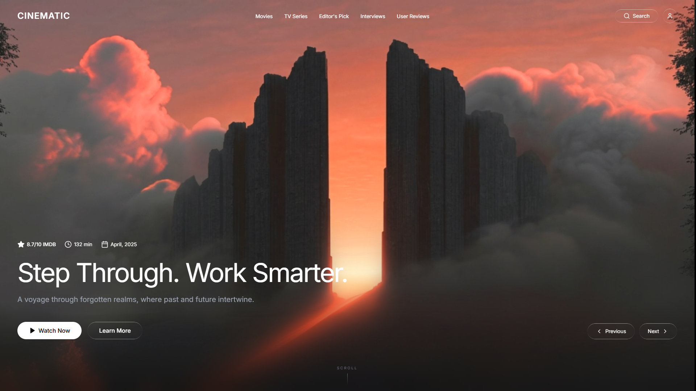
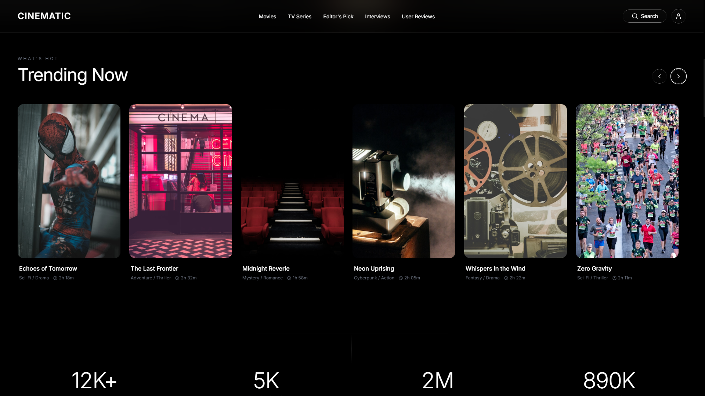

<div align="center">

# CINEMATIC

### A Modern Cinematic Streaming Portal

A visually immersive, animation-rich movie and streaming platform built with React, Tailwind CSS, and Framer Motion. Featuring scroll-driven animations, glassmorphism UI, parallax effects, and a fully responsive design.

**[View Live Demo](https://cinematic-portal.vercel.app/)**

</div>

---

## Preview





> Visit the **[live site](https://cinematic-portal.vercel.app/)** for the full interactive experience with animations, scroll effects, and hover interactions.

---

## Features

- **Cinematic Hero** — Full-viewport background video with parallax zoom and scroll-driven fade
- **Trending Section** — Horizontally scrollable movie cards with 3D tilt-on-hover
- **Animated Stats** — Scroll-triggered number counters with eased animation
- **Category Explorer** — Gradient-styled genre cards with staggered reveal
- **Featured Film** — Parallax imagery, cinematic overlay bars, and detailed synopsis
- **Cast & Crew** — Circular portraits with radial glow and hover bio reveal
- **Critical Acclaim** — Glassmorphism review cards with star ratings
- **Upcoming Releases** — Parallax image cards with notify CTA
- **CTA Section** — Floating orbs, scale-on-scroll, gradient glass container
- **Footer** — Multi-column navigation with animated social icons

### Animation System

| Animation | Description |
|-----------|-------------|
| `ScrollReveal` | Blur + fade + translate from any direction on scroll |
| `StaggerContainer` | Orchestrated stagger for grids and lists |
| `Parallax` | Scroll-speed-linked vertical offset |
| `ScaleOnScroll` | Zoom in/out as element crosses viewport |
| `TextReveal` | Character-by-character blur-fade |
| `MagneticHover` | Cursor-tracking element displacement |

### UI / UX

- **Liquid Glass** — Custom glassmorphism with gradient border strokes
- **Scroll-aware Navbar** — Transparent to frosted-glass on scroll
- **Scroll-to-Top** — Animated floating button
- **Custom Scrollbar** — Minimal 4px white-on-black track
- **Fully Responsive** — Mobile-first with adaptive breakpoints

---

## Tech Stack

| Technology | Purpose |
|------------|---------|
| [React 18](https://react.dev/) | UI framework |
| [Vite](https://vite.dev/) | Build tool & dev server |
| [Tailwind CSS](https://tailwindcss.com/) | Utility-first styling |
| [Framer Motion](https://www.framer.com/motion/) | Scroll & interaction animations |
| [Lucide React](https://lucide.dev/) | Icon library |
| [Vercel](https://vercel.com/) | Deployment |

---

## Project Structure

```
cinematic-portal/
├── public/
├── src/
│   ├── components/
│   │   ├── animations.jsx        # Reusable animation primitives
│   │   ├── TrendingSection.jsx   # Trending movies carousel
│   │   ├── StatsSection.jsx      # Animated statistics
│   │   ├── CategoriesSection.jsx # Genre category grid
│   │   ├── FeaturedSection.jsx   # Featured film spotlight
│   │   ├── CastSection.jsx       # Cast & crew profiles
│   │   ├── ReviewsSection.jsx    # Critic reviews
│   │   ├── UpcomingSection.jsx   # Upcoming releases
│   │   ├── CTASection.jsx        # Call-to-action banner
│   │   └── Footer.jsx            # Site footer
│   ├── data/
│   │   └── movies.js             # Static movie & category data
│   ├── App.jsx                   # Root component with hero & layout
│   ├── index.css                 # Global styles & custom classes
│   └── main.jsx                  # Entry point
├── index.html
├── tailwind.config.js
├── postcss.config.js
├── vite.config.js
└── package.json
```

---

## Getting Started

### Prerequisites

- [Node.js](https://nodejs.org/) v18+
- npm or yarn

### Installation

```bash
# Clone the repository
git clone https://github.com/your-username/cinematic-portal.git
cd cinematic-portal

# Install dependencies
npm install

# Start development server
npm run dev
```

The app will be available at `http://localhost:5173`.

### Build for Production

```bash
npm run build
npm run preview
```

---

## Deployment

This project is deployed on **[Vercel](https://vercel.com/)**. Any push to the `main` branch triggers an automatic deployment.

**Live URL:** [https://cinematic-portal.vercel.app/](https://cinematic-portal.vercel.app/)

---

## License

This project is licensed under the [MIT License](LICENSE).

---

<div align="center">
  <sub>Built with React, Tailwind CSS & Framer Motion</sub>
</div>